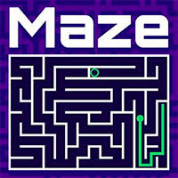

# ⚛️ React Maze 🏃 🕹

Maze made using React and Typescript! 😎



## Installation

```bash
# Clone this repository
$ git clone https://github.com/musoxvi/react-maze.git react-maze

# Go into the repository
$ cd react-maze

# Install dependencies
$ yarn install or npm install
```

## Available Scripts

In the project directory, you can run:

```bash
# Run the server
$ yarn start or npm run start
```

## License

[MIT](https://choosealicense.com/licenses/mit/)
